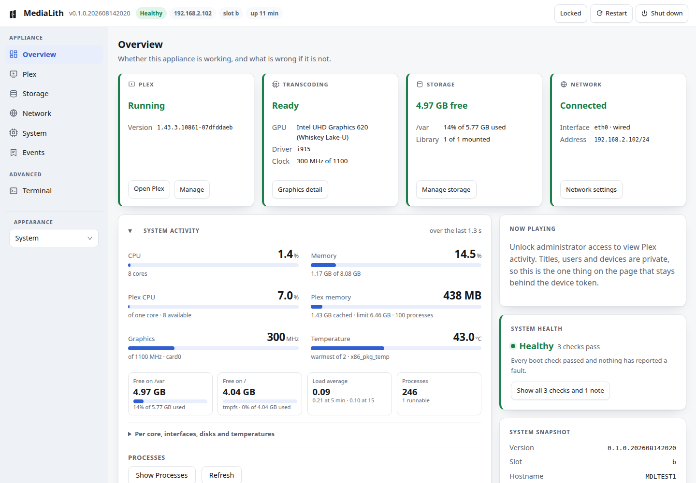
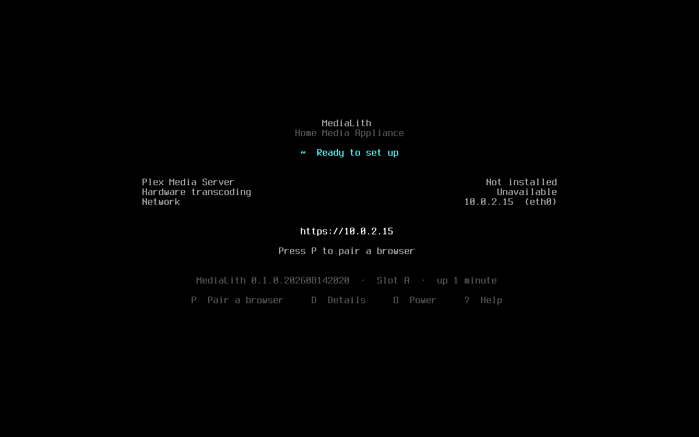
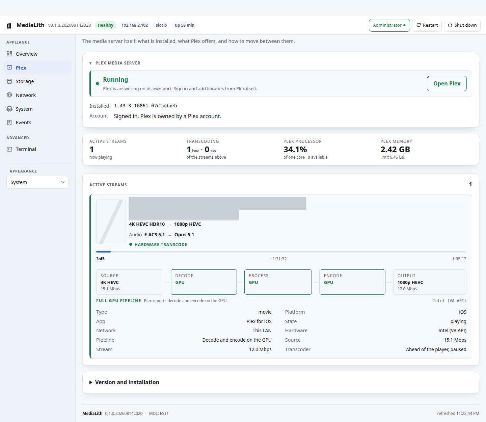
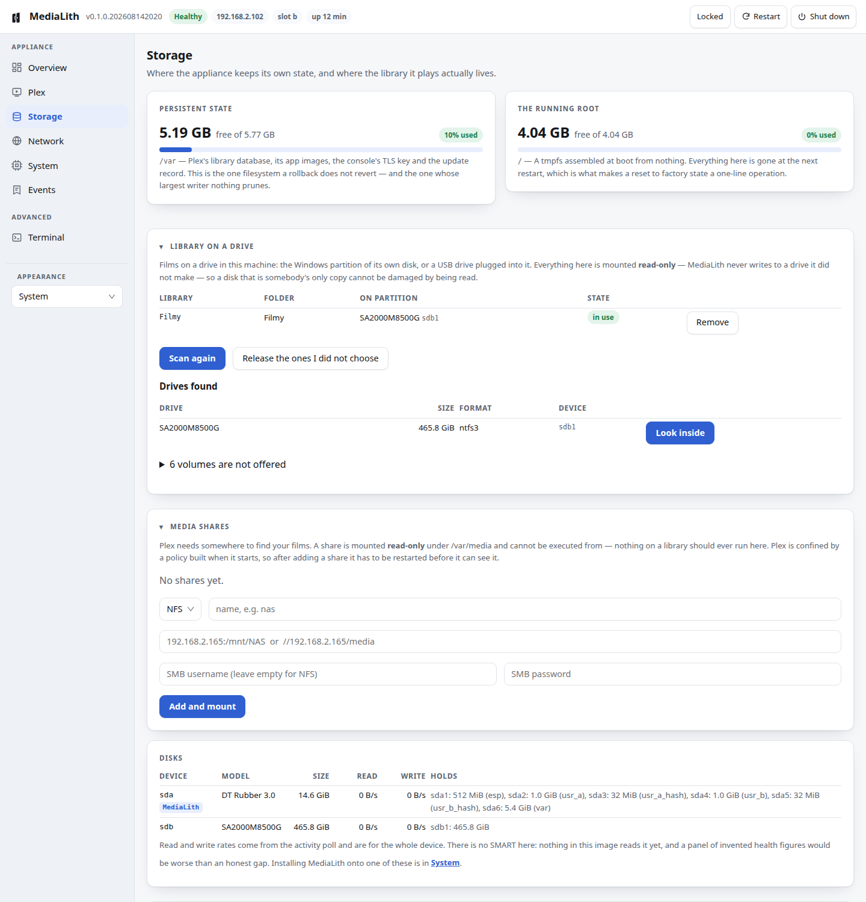
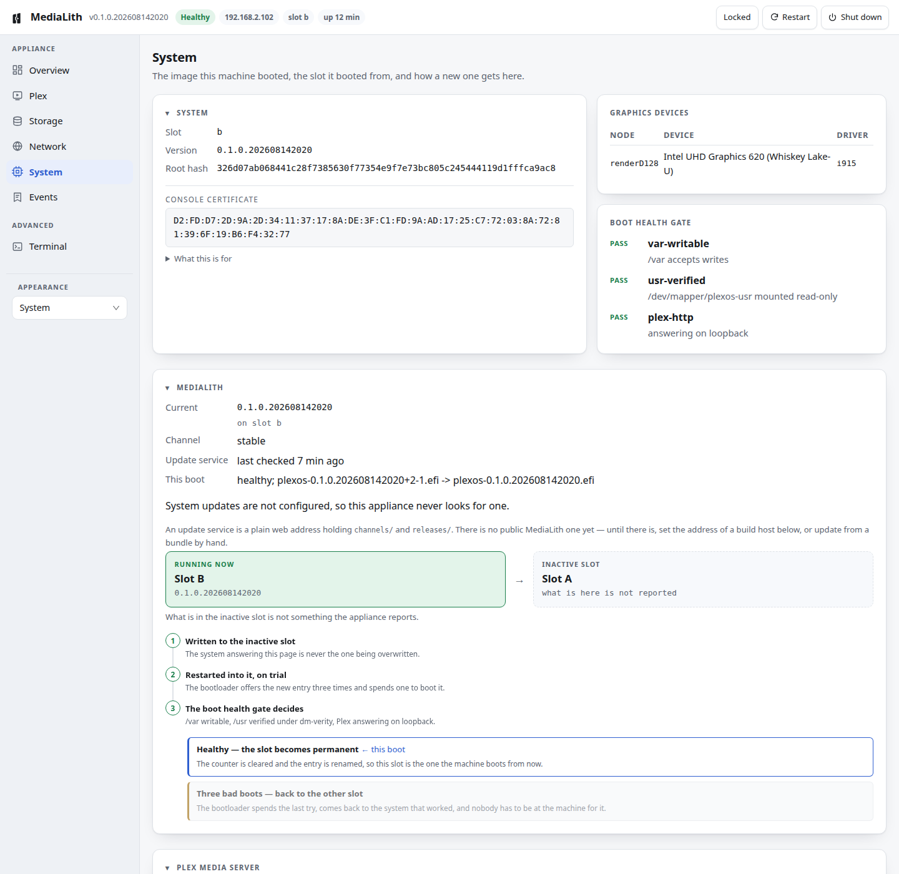
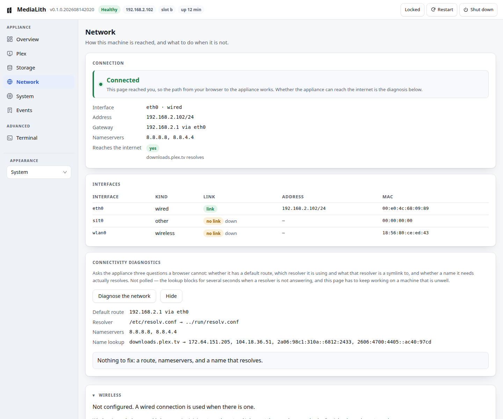

<p align="center">
  
</p>

<p align="center">
  <strong>A Linux appliance that runs Plex Media Server — and says clearly when
  something is wrong.</strong>
</p>

<p align="center">
  <a href="../../releases/latest"><b>Download the Technical Preview</b></a>
  &nbsp;·&nbsp; x86-64 &nbsp;·&nbsp; UEFI &nbsp;·&nbsp; ~194 MB compressed
</p>

> **Technical Preview.** It boots, installs itself, provisions Plex, transcodes 4K HDR on
> the GPU, and supports signed A/B updates with automatic rollback. It has run on four
> machines. **There is no update service yet** — a preview is updated from a bundle by
> hand, and the appliance never goes looking on its own. Try it on a spare box, not on the
> only copy of anything you care about.



A general-purpose distribution running Plex has one characteristic failure: hardware
transcoding stops working and **nothing says so**. Plex falls back to software, the CPU
saturates, playback stutters, and the person who owns the machine is left guessing. Every
layer above the fault reports success, because every layer above the fault runs as root
and the fault is that Plex does not.

MediaLith is a whole system built around not doing that.

| | |
| --- | --- |
| **Write it and boot it** | One image. No distribution to install, no packages to choose |
| **Plex from a browser** | Downloaded from Plex's own endpoint, its signature checked against a pinned key, started confined — cgroup v2, Landlock, uid 900 |
| **Hardware transcoding, or a reason** | Every diagnostic names a remedy. A report that says "unavailable" and stops has reproduced the problem this project exists to fix |
| **Updates that undo themselves** | Two slots and a signed manifest. A bad update boots three times, fails a health gate, and hands the machine back with nobody at it. Applied by hand in the preview — there is no update service yet |
| **Films where they already are** | The Windows partition of the machine's own disk, or a USB drive. Mounted read-only, browsed from the console |
| **Sealed** | `/usr` is a read-only image verified by dm-verity on every boot, and its root hash lives inside a signed kernel image |

> MediaLith is an independent community project and is not affiliated with, endorsed by,
> or sponsored by Plex Inc. Plex and Plex Media Server are trademarks of Plex Inc.
> Previously developed under the working name PlexOS; internal identifiers still use the
> `plexos` namespace, deliberately — see [ADR-0022](docs/adr/0022-medialith-is-the-product-plexos-is-the-namespace.md).

---

## Try MediaLith

The shortest path from this page to a running appliance. Nothing is built and nothing is
installed on the computer's own disks unless you ask for it.

1. **Download** the image and `SHA256SUMS` from [Releases](../../releases/latest), and
   check what you got: `sha256sum -c SHA256SUMS` on Linux, `shasum -a 256 -c SHA256SUMS`
   on macOS.
2. **Decompress** it: `xz -d MediaLith-*.img.xz`
3. **Write it to a USB stick.** ⚠️ **This erases the stick completely, partition table and
   all.** It is the whole disk, never a partition.

   <details><summary><b>Linux</b></summary>

   Find the device with `lsblk`, then — check the name twice, `dd` does not ask:

   ```sh
   sudo dd if=MediaLith-*.img of=/dev/sdX bs=4M status=progress conv=fsync
   ```
   </details>

   <details><summary><b>macOS</b></summary>

   `diskutil list` to find it, then unmount it — do not eject it, the device has to stay
   present. `rdiskN` is the raw device and is many times faster than `diskN`. macOS `dd`
   has no `status=progress`; press Ctrl-T to see where it is.

   ```sh
   diskutil list
   diskutil unmountDisk /dev/diskN
   sudo dd if=MediaLith-*.img of=/dev/rdiskN bs=4m
   ```

   [Balena Etcher](https://etcher.balena.io) does the same thing with a dialog.
   </details>

   <details><summary><b>Windows</b></summary>

   [Rufus](https://rufus.ie) or [Balena Etcher](https://etcher.balena.io). Pick the
   decompressed `.img` and write it in DD mode.
   </details>
4. **Turn Secure Boot off** in the machine's firmware, and boot the stick in **UEFI** mode.
5. **Read the screen.** MediaLith prints its own address and a code to sign in with.

   

   *Captured in a virtual machine, which is why it reports no hardware transcoding.*

6. **Open that address** in a browser on the same network. Press **P** at the machine for a
   QR code that signs a phone in, or type the recovery code it printed.

From there the console installs Plex, finds your drives and sets the machine up. If
something is wrong, it says what and what to do about it.

Building from source is a different job and needs a Linux host with real network access —
see [docs/DEVELOPMENT.md](docs/DEVELOPMENT.md).

## What it looks like

The web console shots are the current build on real hardware. The first-boot console
below is a QEMU capture and is labelled as one — the physical console is a text console on
`tty1` and there is no way to photograph it from here. Nothing anywhere is mocked up.

| | |
| --- | --- |
| **Hardware transcoding, watched live.** 4K HEVC HDR10 down to 1080p, decode and encode both on the GPU. The account, device and title are blurred; nothing else is. |  |
| **A library on a drive in the machine.** An NTFS partition mounted read-only, and the six volumes belonging to MediaLith itself refused. |  |
| **Two slots, and what happens between them.** Shown mid-update: the boot entry renamed, the try counter cleared, this slot made permanent. |  |
| **Three questions a browser cannot ask.** Whether the appliance has a route, which resolver it is using, and whether a name it needs actually resolves. |  |

---

## Status

It runs. Specifics, because "it runs" is the kind of claim this project distrusts:

- **Boots from its own disk** on the reference laptop, `/usr` verified by dm-verity and
  mounted read-only, `/var` writable, `/etc` an overlay, `plexos-init` as PID 1.
- **Installs itself.** The installer is a mode of the running image and writes *the system
  currently running* to a chosen disk. It partitioned and booted a laptop's internal
  465 GiB drive that had Windows on it, in under two minutes.
- **Installs Plex from a browser** — downloads it from Plex's own endpoint, verifies the
  signature against a pinned key, builds an erofs app image, and starts it confined:
  cgroup v2, Landlock, uid 900.
- **Transcodes on the GPU.** 4K HDR10 HEVC Main 10 to 1080p HEVC, `(hw)` on both the
  decode and the encode — on Intel through VA-API, and on an RTX 5060 through NVDEC and
  NVENC.
- **Updates itself over the network** from a signed manifest, with an anti-rollback
  counter and root-signed key revocation. A replayed older release, correctly signed by
  the real key, is refused anyway — the one case no signature check can catch.
- **Undoes a bad update with nobody present.** A bundle whose `/usr` had a data block
  overwritten was installed and booted: three failed boots, then the machine came back on
  the previous release by itself. A second experiment, where the image booted fine but
  Plex could not start, ended the same way.

Seven crates, **1215 tests**, and roughly 39 packages in the base image.

> ### The management console is for a trusted LAN
>
> It offers a root shell and the ability to replace the operating system. It is served
> over TLS with a self-signed certificate — there is no CA and no domain name — and every
> mutating request needs a device token. That stops anyone *listening*. Against an active
> middle it proves nothing until somebody compares the certificate fingerprint, and
> [ADR-0014](docs/adr/0014-console-terminal.md) states plainly that this is unresolved.
> Do not expose it to the internet.

---

## How it works

**One artefact, verified whole.** `/usr` is a read-only erofs image covered by a
dm-verity hash tree. The root hash travels in the kernel command line, inside a unified
kernel image, so the thing that checks the filesystem cannot be edited independently of
the filesystem.

**Two slots.** An update writes a complete new `/usr` to the inactive slot and installs a
boot entry on trial. The bootloader spends a try *to* boot it; a boot that reaches
userspace and passes a health gate makes the slot permanent, and one that does not falls
back. The counter is spent by booting, which is why a failed boot has to end in another
boot rather than in a panic screen — `panic=N` is on the command line for that reason and
a test asserts it.

**The frozen layout** ([ADR-0003](docs/adr/0003-partition-layout.md)), which reaches real
disks and can never be changed afterwards:

| # | Purpose | Size | Filesystem |
| --- | --- | --- | --- |
| 1 | ESP | 512 MiB | FAT32 |
| 2 | `usr_a` | 1 GiB | erofs, read-only |
| 3 | `usr_a` verity hashes | 32 MiB | dm-verity hash tree |
| 4 | `usr_b` | 1 GiB | erofs, read-only |
| 5 | `usr_b` verity hashes | 32 MiB | dm-verity hash tree |
| 6 | `var` | remainder | XFS |

**Rollback reverts `/usr` and never `/var`.** That rule is what makes updates safe and it
is also the sharpest constraint in the system: any migration must leave state the previous
release can still read, and a fault that lives on `/var` cannot be cured by rolling back
at all. Both halves have been demonstrated on hardware, the second one the hard way.

---

## The crates

Everything MediaLith owns is Rust. The kernel stays C, and so does the userland Plex needs —
Plex Media Server is a closed-source, dynamically linked glibc binary, and that constrains
the base.

| Crate | Role | Tests |
| --- | --- | --- |
| `plexos-sys` | The kernel-interface layer: verity, dm ioctls, mount, execve, Landlock, privilege dropping, PTYs, reaping | 123 |
| `plexos-init` | PID 1. Plans and executes the boot, then supervises what it started | 91 |
| `plexosd` | The console: HTTP server, status, installer, updater, settings, terminal, TLS, local drives | 690 |
| `plexos-plex` | Provisioning Plex from its own signed packages, and confining it | 106 |
| `plexos-update` | A/B updates, the signed trust chain, anti-rollback, revocation | 68 |
| `plexos-types` | Every on-disk and on-wire format, plus the GPT writer | 74 |
| `plexos-gpu` | Whether hardware transcoding works, and if not, what to do | 57 |

The crate names are the legacy `plexos-*` namespace and stay that way for now — see [Names
that did not change](#names-that-did-not-change).

**`unsafe` is forbidden everywhere except `plexos-sys`**, which exists so that it can be.
PID 1 has to issue syscalls; confining them to one small crate keeps the unsafe
reviewable, and every block there carries a soundness comment enforced by a lint.

---

## `plexos-gpu` runs anywhere

It is useful on its own, on any Linux system, and it is the shortest way to see what this
project is about. If you are sizing up a machine as a Plex box, this answers whether its
hardware transcoding actually works:

```sh
cargo run -p plexos-gpu            # human-readable report
cargo run -p plexos-gpu -- --json  # for tooling

# exit status: 0 ready, 1 degraded, 2 unavailable
```

**Every finding names a remedy**, and a test enforces it. A report that says "hardware
acceleration unavailable" and stops has reproduced the problem this project exists to fix.

The rule earns its keep. Moving a USB stick between four machines in two days found three
defects that months of reading code had not: a discrete card with no driver bound, which
through `/sys/class/drm` is indistinguishable from having no graphics at all; a render
node at `0600 root:root`, invisible because every probe above it runs as root while Plex
does not; and GuC/HuC firmware shipped for exactly one chip generation, which transcoded
at reduced quality on a different laptop and reported success throughout.

---

## Requirements

CPU and platform are separate questions, and conflating them is how a project ends up
claiming it runs on "any x86-64 PC".

**Processor.** A 64-bit x86 processor, and nothing above the architectural baseline —
`-march=x86-64`, which is MMX, SSE and SSE2. MediaLith requires no SSE3, no SSSE3, no
SSE4, no POPCNT, no `CMPXCHG16B`, no AVX. That is measured rather than assumed: the
kernel's own `X86_REQUIRED_FEATURE_*` list for `x86_64` asks for nothing more, the three
Rust binaries are built with no `-C target-cpu`, and Plex Media Server carries its own
musl runtime and dispatches on CPUID at run time.

Verified by booting the actual image under QEMU + OVMF with software emulation (TCG, not
KVM — KVM masks CPUID without removing the instruction, so it cannot answer this) on
`Opteron_G1`, `Conroe`, `Nehalem` and `Haswell` CPU models. On every one of them the
machine reached firmware, kernel, PID 1, a dm-verity `/usr`, the network, the console,
and Plex answering on loopback. **These are emulated CPU models, not physical
machines**; no processor older than the reference laptop's Core i5-8265U has been tried
in silicon.

**Platform.** UEFI x86-64, GPT, and a disk and network adapter this kernel has a driver
for. That is the constraint that actually decides whether a given machine works, and it
is unchanged by the paragraph above: there is no legacy BIOS support, and a machine
whose storage or NIC is not in the built-in driver set has no second chance, because
there are no loadable modules for it.

**Hardware transcoding** is a third question again, answered by `plexos-gpu` per machine.

## Hardware

| Machine | State |
| --- | --- |
| Core i5-8265U / UHD 620 (reference) | Full: boots, installs, provisions, transcodes on the iGPU |
| Alder Lake-P laptop | Transcodes on the iGPU |
| RTX 5060 desktop, no integrated graphics | Transcodes through NVDEC/NVENC, open modules 610.57.04 |
| Intel Arc | `CONFIG_DRM_XE=y` and firmware installed, **never tried — no hardware here** |
| AMD | Not built. Deliberately unscheduled |

**Secure Boot must be turned off.** Kernel images are self-signed and no keys are enrolled
([ADR-0004](docs/adr/0004-verified-boot.md)). This is separate from update signing, which
is done.

---

## Design principles

1. **Irreversible decisions first.** Partition GUIDs, the manifest schema, the config
   schema and the `/var` layout reach real devices and cannot be changed afterwards. They
   live in `plexos-types` and are treated as append-only.
2. **Rollback is not a feature, it is the default.** An update that boots badly must undo
   itself without a human present.
3. **Every diagnostic names a remedy.**
4. **Verify, don't recall.** Buildroot option names, kernel `CONFIG_*` symbols and PCI IDs
   are checked against the tree or a capture. Guessing there has cost real bugs.
5. **Report what is unverified.** Files that have never been built or executed say so at
   the top, and the notice is deleted only when the thing has actually run.
6. **A narrow package set.** CVE maintenance is what kills small distributions; the only
   defence is having little to maintain.

The most useful document here may be the "known traps" list in
[CLAUDE.md](CLAUDE.md) — every entry is a fault that reached hardware, written down in
the form that would have caught it. A recurring shape: *a control that is correct in the
state it was written in can be wrong in the state its own success produces.*

---

## Names that did not change

The product is MediaLith. A good deal of the machinery still says `plexos`, and that is a
decision rather than an unfinished job: these names are **contracts with disks and with
releases already in the field**, and this appliance is built so that a new release can
fail and hand the machine back to an older one.

| Still says `plexos` | Why it must |
| --- | --- |
| `product` in the update manifest | The updater refuses a bundle whose product differs. A MediaLith build claiming `medialith` would be **refused by every machine already installed**, leaving reinstallation — and a fresh `/var` — as the only route |
| `/var/lib/plexos/**` | The one surface a rollback does not revert. The device token, the TLS key, the anti-rollback floor and the revocation list live here, and the release a rollback lands on must still find them |
| `/etc/plexos/config.toml` | Persistent state wearing an `/etc` address: the overlay's upper layer is on `/var`. Renaming it silently reverts a machine's hostname, timezone and addressing to defaults |
| `plexos.slot`, `plexos.roothash` | Inside each signed UKI, including the previous release's. A build that only understood new names could not boot the image it is supposed to fall back to |
| `plexos-<version>.efi` boot entries | Written by the release *installing* an update, read by the release *booting* it. A disagreement leaves the try counter uncleared and the machine rolls itself back three reboots later, looking like a hardware fault |
| `ID` and `SORT_KEY` in `os-release` | `SORT_KEY` is what systemd-boot groups entries by, and a mixed ESP would be two groups. `ID` has no consumer here at all |
| Crate and binary names — `plexos-sys`, `plexosd`, … | A large diff, no user-visible benefit, and every build script, package definition and image assembly step is an opportunity to break something that works. The daemon is *the MediaLith management daemon*; the executable is still `plexosd` |

Public branding does not have to match an on-disk namespace, and here it deliberately does
not. **This is settled rather than pending**: [ADR-0022](docs/adr/0022-medialith-is-the-product-plexos-is-the-namespace.md)
records it as an accepted decision, including why migrating only the cheap half would be
worse than either end state.

## What is not done

- **Secure Boot keys** are not enrolled, so images are self-signed.
- **The root signing key is a development key.** Its private half sits on a build host,
  and every place that reports a signature says so.
- **Arc and AMD are unverified.** One has no hardware here; the other is not built.
- **Image builds are not in CI.** `.github/workflows/ci.yml` checks formatting, clippy,
  the test suite and the documentation on every pull request and every push to `main`, and
  `main` is protected so nothing lands without it. It covers the Rust workspace only.
  Building an image needs 24 GB of working tree against the 14 GB a GitHub-hosted runner
  offers, so images are built on a machine with a Buildroot tree and tested by being put on
  hardware. This line has been wrong twice before by describing a state its own commit
  ended; what is written here was measured on 2026-08-14.

## Licensing

- **MediaLith's own code is [Apache-2.0](LICENSE)** — everything in `crates/`, `buildroot/`
  and `tools/`.
- **The kernel is GPL-2.0**, unmodified mainline built by Buildroot, and the rest of the
  base userland carries its own upstream licences. An image is an aggregate of separately
  licensed works, not a derivative of this repository.
- **Plex Media Server is proprietary** and is not redistributed inside MediaLith images. It is
  fetched from Plex's own servers at provisioning time
  ([ADR-0010](docs/adr/0010-plex-provisioning.md)).
- **NVIDIA's userspace libraries are proprietary.** Their licence permits redistribution
  only if the binaries are unmodified *and* the agreement ships to each recipient. The
  kernel modules are the open ones, dual MIT/GPL. This repository contains the build
  recipe, not the binaries.

## Building

The Rust workspace builds anywhere:

```sh
cargo test --workspace
```

Image builds need a Linux host with real network access — Buildroot fetches from a dozen
hosts. See [docs/DEVELOPMENT.md](docs/DEVELOPMENT.md).

## Reading further

Start with [docs/ARCHITECTURE.md](docs/ARCHITECTURE.md), then
[docs/adr/](docs/adr/) for why anything is the way it is. Twenty-two decision records, each
with the context that forced it.
